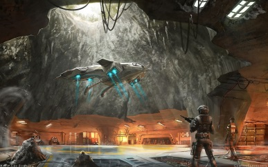
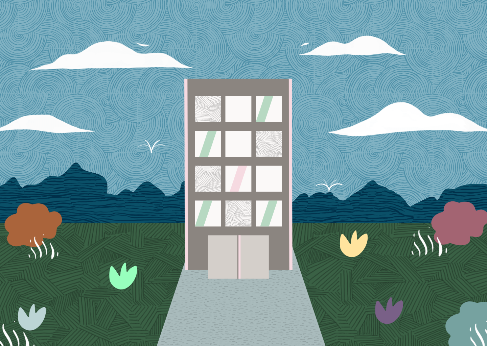

# GDD - Game Design Document - Módulo 1 - Inteli

**_Os trechos em itálico servem apenas como guia para o preenchimento da seção. Por esse motivo, não devem fazer parte da documentação final_**

## The Knowledge Elevator
### The Building

#### Nomes dos integrantes do grupo
- <a href="https://www.linkedin.com/in/caio-de-alcantara-santos-a020921b4/">Caio de Alcantara Santos</a>
- <a href="https://www.linkedin.com/in/cec%C3%ADlia-galv%C3%A3o/">Cecília Beatriz Melo Galvão</a>
- <a href="https://www.linkedin.com/in/victorbarq/">Giacomo Zema Matizonkas</a> 
- <a href="https://www.linkedin.com/in/ian-pereira-simao/">Ian Pereira Simão</a> 
- <a href="https://www.linkedin.com/in/kethlen-martins-040332221/">Kethlen Martins da Silva</a>
- <a href="https://www.linkedin.com/in/nataly-cunha">Nataly de Souza Cunha</a> 
- <a href="https://www.linkedin.com/in/victorbarq/">Vinicius Maciel Flor</a>

## Sumário

[1. Introdução](#c1)

[2. Visão Geral do Jogo](#c2)

[3. Game Design](#c3)

[4. Desenvolvimento do jogo](#c4)

[5. Casos de Teste](#c5)

[6. Conclusões e trabalhos futuros](#c6)

[7. Referências](#c7)

[Anexos](#c8)

 

# 1. Introdução (sprints 1 e 4)

## 1.1. Escopo do Projeto

### 1.1.1. Contexto da indústria (sprints 1 e 4)

A **Oracle Academy** fornece **educação na área de tecnologia**, gratuitamente, para alunos e instituições **mundialmente**. Cursos, workshops e materiais de apoio são disponibilizados aos professores, que passam este conteúdo para os alunos. A Oracle Academy está inserida em um **mercado de educação**, dinâmico, em constante evolução e com **fortes concorrentes**, como a Microsoft Imagine Academy, IBM Skills e AWS Academy. \
Em suma, a Oracle Academy é uma das **principais players** quando se fala de programas educativos em tecnologia gratuitos e online, abrangendo um **mercado verdadeiramente global**, presente em diversos países e realizando **parcerias com instituições e organizações** do mundo inteiro. 

### 1.1.2. Análise SWOT (sprints 1 e 4)
A Análise SWOT é uma ferramenta que busca realizar um planejamento estratégico onde empresas identificam quais são as suas forças, fraquezas, oportunidades e ameaças, buscando entender os diversos aspectos internos (que podem ser controlados) e aspectos externos (que independem da empresa) que podem impactar o negócio. 
   
 

Ao realizar a Análise SWOT da Oracle Academy, percebemos diversos pontos que devem ser levados em consideração, sendo que um dos principais é a fraqueza relacionada à qualidade visual e a experiência que os usuários têm ao usar a plataforma, problemas não tão fortes em plataformas concorrentes como a IBM Skills e a Microsoft Academy. 

### 1.1.3. Descrição da Solução Desenvolvida (sprints 1 e 4)

A Oracle Academy nasceu como uma iniciativa filantrópica através da criação de um programa educacional gratuito. Desse modo, a plataforma oferece recursos para que professores possam aprimorar suas habilidades e promover a educação. Todavia, observa-se que boa parte desses profissionais possui dificuldades em compreender a abrangência dos recursos disponíveis, o que se reflete na baixa do engajamento desses usuários.\
Assim, para a resolução do impasse, dados foram coletados provenientes de documentos, como o Termo de Abertura de Projeto do Inteli (TAPI), o Guia de Estilo de Marca e diversos manuais de utilização da plataforma. Ademais, informações foram tiradas do próprio site da Oracle e de rodas de conversação com representantes legais da organização, ocorrendo, consequentemente, a dissolução de questões.
Á vista disso, com a utilização dos dados, a solução será desenvolvida como uma experiência gamificada para web, na qual professores possam conhecer todos os produtos e serviços disponibilizados na Oracle Academy, de forma intuitiva e atraente, a fim de aprimorar a percepção de valor da plataforma e o engajamento de potenciais clientes.\
Dessa forma, o "serious game" deverá ser utilizado como uma ferramenta para atrair a atenção e o interesse dos professores na plataforma da Oracle Academy, atuando com o objetivo de facilitar a integração do docente com a plataforma, por meio de pequenas fases que irão simular a experiência real do usuário, considerando a sua grande gama de recursos.\
Isso posto, o objetivo do serious game é que ocorra o aumento no engajamento e satisfação dos professores em relação ao programa da Oracle Academy, contribuindo para a utilização efetiva das ferramentas da plataforma e para a chegada da mesma em outras instituições de ensino e docentes.\
Logo, o critério de sucesso será feito através do controle de utilização dos usuários, ou seja, a medida que será utilizada para avaliação será o engajamento dos professores em relação ao game criado e, por conseguinte, à plataforma da Oracle Academy.

### 1.1.4. Proposta de Valor (sprints 1 e 4)
  

O VPC é uma ferramenta utilizada para ajudar empresas a compreenderem melhor as necessidades e desejos de seus clientes, assim como para desenvolver propostas de valor que atendam a essas necessidades de forma eficaz.
Ao avaliar o VPC da Oracle Academy, identificamos uma preocupação significativa relacionada à experiência visual e usabilidade da plataforma. 

### 1.1.5. Matriz de Riscos (sprints 1 e 4)

 

A partir do contexto atual do projeto depreende-se que as possibilidades tendo em vista a progressão de impacto e probababilidades se dá da seguinte forma:
Tabela de Níveis:

Impacto: Trivial, Pequeno, Moderado, Grande e Enorme.

Probabilidade: Raro, Improvável, moderado, Provável, Bastante provável.

   #Ameaças
- Falta de acesso à plataforma para estudo do projeto.

  • Probabilidade: Bastante provável

  • Impacto: Trivial

  • Justificativa: Nós como alunos e desenvolvedores do projeto não teremos acesso à plataforma, por outro lado, haverá um vídeo explicativo das ferramentas oferecidas dentro do site.

  • Plano de ação: Apesar da falta de acesso por nós (alunos) à plataforma, teremos como base os vídeos disponibilizados pela marca para fazer cada etapa do game.

- Baixa otimização.

  • Probabilidade: Moderado

  • Impacto: Moderado

  • Justificativa: Por se tratar de um tempo escasso de desenvolvimento de game, o código pode conter trechos redundantes e que poderiam ser escritos de forma mais simplificada.

  • Plano de ação: Caso o a otimização do jogo for baixa em virtude do excesso de assets, código pesado ou qualquer outro motivo, iremos refinar o código e sprites com ajuda dos orientadores. 
  
- Design desalinhado com a Redwood.

  • Probabilidade: Improvável

  • Impacto: Grande

  • Justificativa: Nosso grupo acredita na importância de seguir a identidade da marca, por isso este desalinhamento é pouquíssimo provável.

  • Plano de ação: Estamos estudando veemente a estrutura de design da marca, construindo texturas dentro da guideline e sprites que compactuam com os formatos da marca.

- Baixa assistência da Marca quanto ao projeto.

  • Probabilidade: Raro

  • Impacto: Grande
  
  • Justificativa: Tratando-se de um projeto com parceiros e levando em conta já a atenção dada ao projeto, acreditamos que seja raríssima a possibilidade deste acontecimento, caso contrário, teria Grande impacto no desenvolvimento.

  • Plano de ação: Caso a assistência em relação a produção do projeto seja baixa, ainda assim produziremos o game, mas dessa vez baseando-nos somente nas "tasks" principais do documento e as regras a serem seguidas.

- Integração ruim com a plataforma.

  • Probabilidade: Moderado

  • Impacto: Moderado

  • Justificativa: Tendo em vista a falta de conhecimento dos integrantes do grupo em relação ao código por trás da plataforma, fica clara a preocupação quanto à integração do jogo com o website.

  • Plano de ação: Caso haja baixa integração com a plataforma mudaremos o plano de ação para que possamos com amparo do parceiro implementar novas estratégias para melhorar a compatibilidade com a plataforma.

   #Oportunidades

- Estética compatível com a expectativa da marca.

  • Probabilidade: Provável

  • Impacto: Grande

  • Justificativa: Como citado anteriormente, nosso grupo tem grande preocupação com as regras de identidade visual da marca, e acreditamos ser fundamental para a entrega do projeto.
  
- Autorização de uso de música pela marca e autor.

  • Probabilidade: Moderado

  • Impacto: Pequeno

  • Justificativa: Ao fazer algumas pesquisas deparamo-nos com uma opção valiosa de trilha sonora para o game, acreditamos que ela entregará a sensação desejada por nós ao usuário (low-profile, Minimalista e confortável).
  
- Acessibilidade Etária.

  • Probabilidade: Provável

  • Impacto: Enorme

  • Justificativa: Dada a amplitude de faixas etárias que utilizaram o "game" crê-se que seja de enorme importância que tenhamos ferramentas que tornem simples a jornada do usuário independente de sua idade.
  
- Dinâmica de jogo engajadora.

  • Probabilidade: Moderado

  • Impacto: Enorme

  • Justificativa: O público alvo do "game" tem características muito amplas, portanto, fica dificil definir uma estética e uma abordagem a se focar no desenvolvimento para que haja engajamento de todos os usuários.

- Facilidade de acesso para professores.

  • Probabilidade: Provável

  • Impacto: Enorme
  
  • Justificativa: Tendo em vista que este é o objetivo principal do projeto, acreditamos que criar um jogo de aprendizado intuitivo e que faça com que o usuário memorize os processo de maneira dinâmica seja nossa prioridade.

## 1.2. Requisitos do Projeto (sprints 1 e 2)

*Posicione aqui a lista de requisitos levantados para o projeto, sejam pedidos do parceiro ou invenções do grupo. Descreva-os de forma objetiva, de modo que seja possível entender claramente como implementá-los tecnicamente.*

*ATUALIZE ESTA SEÇÃO SEMPRE QUE ALGUM REQUISITO MUDAR EM SEU PROJETO*

*Exemplo de tabela de requisitos*
\# | Requisito  
--- | ---
1 | O jogo precisa ser um "serious game", sem elementos risíveis
2 | A jogabilidade deve ser em primeira pessoa, com o professor atuando como protagonista da história
3 | Toda a arte do jogo deve ser baseada na identidade visual da Oracle Academy, incluindo ícones, desenhos e paleta de cores
4 | Devem haver pelo menos 5 fases no jogo: cadastro, conhecendo a plataforma, canais, cloud e sessão de suporte
5 | O jogo deve seguir uma estética minimalista e "low-profile", sem muitos detalhes que distraiam o jogador
6 | O jogador terá que realizar tarefas relacionadas ao assunto da fase para acumular pontos e, assim, passar de fase
7 | Ao final do jogo, o jogador poderá conquistar um "Badge" que certifica que ele concluiu o jogo 
8 | As tarefas que o jogador terá que realizar têm que ser engajadoras
9 | Os movimentos do jogo serão realizados com uma mecânica "point and click"
10 | A princípio, o jogo deverá ser desenvolvido apenas para Desktop

## 1.3. Público-alvo do Projeto (sprint 2)

*Posicione aqui uma descrição justificada do público-alvo do jogo, em termos demográficos e de preferências/gostos pessoais.*

# 2. Visão Geral do Jogo (sprint 2)

## 2.1. Objetivos do Jogo (sprint 2)

*Descreva o que o jogador deve cumprir para avançar ou concluir o jogo*

## 2.2. Características do Jogo (sprint 2)

### 2.2.1. Gênero do Jogo (sprint 2)

*simulação, RPG, corrida, estratégia, esportes, ação, aventura etc.*  

### 2.2.2. Plataforma do Jogo (sprint 2)

*quanto ao dispositivo: desktop, smartphones, tablets, TV etc.*

*quanto ao sistema: Web, Windows, MacOS, Android, IOS etc.*

### 2.2.3. Número de jogadores (sprint 2)

*1 jogador, 2 jogadores versus, 2 jogadores cooperação, multiplayer etc.*

### 2.2.4. Títulos semelhantes e inspirações (sprint 2)

*Liste e descreva títulos semelhantes e jogos que inspiram e são usados como referência do projeto*

### 2.2.5. Tempo estimado de jogo (sprint 5)

*Ex. O jogo pode ser concluído em 3 horas passando por todas as fases.*

*Ex. cada partida dura até 15 minutos*

# 3. Game Design (sprints 2 e 3)

## 3.1. Enredo do Jogo (sprints 2 e 3)

*Descreva o enredo/história do jogo, criando contexto para os personagens (seção 3.2) e o mundo do jogo (seção 3.3). Uma boa história costuma ter um arco narrativo de contexto, conflito e resolução. Utilize etapas sequenciais para descrever esta história.* 

*Caso seu jogo não possua enredo/história (ex. jogo Tetris), mencione os motivos de não existir e como o jogador pode se contextualizar com o ambiente do jogo.*

## 3.2. Personagens (sprints 2 e 3)

### 3.2.1. Controláveis

*Descreva os personagens controláveis pelo jogador. Mencione nome, objetivos, características, habilidades, diferenciais etc. Utilize figuras (character art, sprite sheets etc.) para ilustrá-los. Caso utilize material de terceiros em licença Creative Commons, não deixe de citar os autores/fontes.* 

*Caso não existam personagens (ex. jogo Tetris), mencione os motivos de não existirem e como o jogador pode interpretar tal fato.*

### 3.2.2. Non-Playable Characters (NPC)

*\<opcional\> Se existirem coadjuvantes ou vilões, aqui é o local para descrevê-los e ilustrá-los. Utilize listas ou tabelas para organizar esta seção. Caso utilize material de terceiros em licença Creative Commons, não deixe de citar os autores/fontes. Caso não existam NPCs, remova esta seção.*

### 3.2.3. Diversidade e Representatividade dos Personagens

Considerando as personagens do game, analise se estas estão alinhadas ao público-alvo do jogo (seção 1.3), e compare-as dentro da realidade da sociedade brasileira. Por fim, discorra sobre qual é o impacto esperado da escolha dessas personagens.

## 3.3. Mundo do jogo (sprints 2 e 3)

### 3.3.1. Locações Principais e/ou Mapas (sprints 2 e 3)

*Descreva o ambiente do jogo, em que locais ele ocorre. Ilustre com imagens. Se houverem mapas, posicione-os aqui, descrevendo as áreas em acordo com o enredo. Se houverem fases, descreva-as também em acordo com o enredo (pode ser um jogo de uma fase só). Utilize listas ou tabelas para organizar esta seção. Caso utilize material de terceiros em licença Creative Commons, não deixe de citar os autores/fontes.*

### 3.3.2. Navegação pelo mundo (sprints 2 e 3)

*Descreva como os personagens se movem no mundo criado e as relações entre as locações – como as áreas/fases são acessadas ou desbloqueadas, o que é necessário para serem acessadas etc. Utilize listas ou tabelas para organizar esta seção.*

### 3.3.3. Condições climáticas e temporais (sprints 2 e 3)

*\<opcional\> Descreva diferentes condições de clima que podem afetar o mundo e as fases, se aplicável*

*Caso seja relevante, descreva como o tempo passa, se ele é um fator limitante ao jogo (ex. contagem de tempo para terminar uma fase)*

### 3.3.4. Concept Art (sprint 2)

*Inclua imagens de Concept Art do jogo que ainda não foram demonstradas em outras seções deste documento. Para cada imagem, coloque legendas, como no exemplo abaixo.*

Figura 1: detalhe da cena da partida do herói para a missão, usando sua nave

### 3.3.5. Trilha sonora (sprint 3)

*Descreva a trilha sonora do jogo, indicando quais músicas serão utilizadas no mundo e nas fases. Utilize listas ou tabelas para organizar esta seção. Caso utilize material de terceiros em licença Creative Commons, não deixe de citar os autores/fontes.*

*Exemplo de tabela*
\# | titulo | ocorrência | autoria
--- | --- | --- | ---
1 | tema de abertura | tela de início | própria
2 | tema de combate | cena de combate com inimigos comuns | Hans Zimmer
3 | ... 

## 3.4. Inventário e Bestiário (sprint 3)

### 3.4.1. Inventário

*\<opcional\> Caso seu jogo utilize itens ou poderes para os personagens obterem, descreva-os aqui, indicando títulos, imagens, meios de obtenção e funções no jogo. Utilize listas ou tabelas para organizar esta seção. Caso utilize material de terceiros em licença Creative Commons, não deixe de citar os autores/fontes.* 

*Exemplo de tabela*
\# | item |  | como obter | função | efeito sonoro
--- | --- | --- | --- | --- | ---
1 | moeda |  | há muitas espalhadas em todas as fases | acumula dinheiro para comprar outros itens | som de moeda
2 | madeira |  | há muitas espalhadas em todas as fases | acumula madeira para construir casas | som de madeiras
3 | ... 

### 3.4.2. Bestiário

*\<opcional\> Caso seu jogo tenha inimigos, descreva-os aqui, indicando nomes, imagens, momentos de aparição, funções e impactos no jogo. Utilize listas ou tabelas para organizar esta seção. Caso utilize material de terceiros em licença Creative Commons, não deixe de citar os autores/fontes.* 

*Exemplo de tabela*
\# | inimigo |  | ocorrências | função | impacto | efeito sonoro
--- | --- | --- | --- | --- | --- | ---
1 | robô terrestre |  |  a partir da fase 1 | ataca o personagem vindo pelo chão em sua direção, com velocidade constante, atirando parafusos | se encostar no inimigo ou no parafuso arremessado, o personagem perde 1 ponto de vida | sons de tiros e engrenagens girando
2 | robô voador |  | a partir da fase 2 | ataca o personagem vindo pelo ar, fazendo movimento em 'V' quando se aproxima | se encostar, o personagem perde 3 pontos de vida | som de hélice
3 | ... 

## 3.5. Gameflow (Diagrama de cenas) (sprint 2)

*Posicione aqui seu "storyboard de programação" - o diagrama de cenas do jogo. Indique, por exemplo, como o jogo começa, quais opções o jogador tem, como ele avança nas fases, quais as condições de 'game over', como o jogo reinicia. Seu diagrama deve representar as classes, atributos e métodos usados no jogo.*

## 3.6. Regras do jogo (sprint 3)

*Descreva aqui as regras do seu jogo: objetivos/desafios, meios para se conseguir alcançar*

*Ex. O jogador deve pilotar o carro e conseguir terminar a corrida dentro de um minuto sem bater em nenhum obstáculo.*

*Ex. O jogador deve concluir a fase dentro do tempo, para obter uma estrela. Se além disso ele coletar todas as moedas, ganha mais uma estrela. E se além disso ele coletar os três medalhões espalhados, ganha mais uma estrela, totalizando três. Ao final do jogo, obtendo três estrelas em todas as fases, desbloqueia o mundo secreto.*  

## 3.7. Mecânicas do jogo (sprint 3)

*Descreva aqui as formas de controle e interação que o jogador tem sobre o jogo: quais os comandos disponíveis, quais combinações de comandos, e quais as ações consequentes desses comandos. Utilize listas ou tabelas para organizar esta seção.*

*Ex. Em um jogo de plataforma 2D para desktop, o jogador pode usar as teclas WASD para mecânicas de andar, mirar para cima, agachar, e as teclas JKL para atacar, correr, arremesar etc.*

*Ex. Em um jogo de puzzle para celular, o jogador pode tocar e arrastar sobre uma peça para movê-la sobre o tabuleiro, ou fazer um toque simples para rotacioná-la*

# 4. Desenvolvimento do Jogo

## 4.1. Desenvolvimento preliminar do jogo (sprint 1)

Para a primeira sprint, entregamos a cena inicial do jogo. Em termos de código, criamos os arquivos iniciais, tais como o index.html e os arquivos JavaScript do jogo em si. Além disso, programamos a tela inicial, adicionando a ela todos os assets que produzimos à mão seguindo o padrão Redwood, bem como animamos elementos como nuvens e pássaros, que configuravam um dos requisitos da entrega do artefato. 

Parte do código, mostrando a criação da tela inicial e o carregamento de alguns assets
  

Tela inicial do jogo
  
A maior dificuldade que tivemos foi com os aspectos de design e de criação de elementos para a tela inicial que seguisse a identidade visual da Oracle Academy. Depois de ter as artes prontas, o processo de "colocar tudo na tela" e fazer as animações foi relativamente simples e feito em cerca de um dia.   
Dando seguimento ao desenvolvimento do jogo, pretendemos adicionar:   
- A funcionalidade de o jogo iniciar assim que o jogador clicar em qualquer lugar da tela     
- A animação da start do jogo  
- Implementar pelo menos duas cenas funcionando (com elementos gráficos e mecânicas)  
- Animar a vegetação, a logo e o texto da tela inicial  
- Publicar o projeto no GitHub Pages  

## 4.2. Desenvolvimento básico do jogo (sprint 2)

*Descreva e ilustre aqui o desenvolvimento da versão básica do jogo, explicando brevemente o que foi entregue em termos de código e jogo. Utilize prints de tela para ilustrar. Indique as eventuais dificuldades e próximos passos.*

## 4.3. Desenvolvimento intermediário do jogo (sprint 3)

*Descreva e ilustre aqui o desenvolvimento da versão intermediária do jogo, explicando brevemente o que foi entregue em termos de código e jogo. Utilize prints de tela para ilustrar. Indique as eventuais dificuldades e próximos passos.*

## 4.4. Desenvolvimento final do MVP (sprint 4)

*Descreva e ilustre aqui o desenvolvimento da versão final do jogo, explicando brevemente o que foi entregue em termos de MVP. Utilize prints de tela para ilustrar. Indique as eventuais dificuldades e planos futuros.*

## 4.5. Revisão do MVP (sprint 5)

*Descreva e ilustre aqui o desenvolvimento dos refinamentos e revisões da versão final do jogo, explicando brevemente o que foi entregue em termos de MVP. Utilize prints de tela para ilustrar.*

# 5. Testes (sprint 4)

## 5.1. Casos de Teste

*Descreva nesta seção os casos de teste comuns que podem ser executados a qualquer momento para testar o funcionamento e integração das partes do jogo. Utilize tabelas para facilitar a organização.*

*Exemplo de tabela*
\# | pré-condição | descrição do teste | pós-condição 
--- | --- | --- | --- 
1 | posicionar o jogo na tela de abertura | iniciar o jogo desde seu início | o jogo deve iniciar da fase 1
2 | posicionar o personagem em local seguro de inimigos | aguardar o tempo passar até o final da contagem | o personagem deve perder uma vida e reiniciar a fase
3 | ...

## 5.2. Testes de jogabilidade (playtests) (sprint 4)

### 5.2.1 Registros de testes

*Descreva nesta seção as sessões de teste/entrevista com diferentes jogadores. Registre cada teste conforme o template a seguir.*

Nome | João Jonas (use nomes fictícios)
--- | ---
Já possuía experiência prévia com games? | sim, é um jogador casual
Conseguiu iniciar o jogo? | sim
Entendeu as regras e mecânicas do jogo? | entendeu as regras, mas sobre as mecânicas, apenas as essenciais, não explorou os comandos complexos
Conseguiu progredir no jogo? | sim, sem dificuldades  
Apresentou dificuldades? | Não, conseguiu jogar com facilidade e afirmou ser fácil
Que nota deu ao jogo? | 9.0
O que gostou no jogo? | Gostou  de como o jogo vai ficando mais difícil ao longo do tempo sem deixar de ser divertido
O que poderia melhorar no jogo? | A responsividade do personagem aos controles, disse que havia um pouco de atraso desde o momento do comando até a resposta do personagem

### 5.2.2 Melhorias

*Descreva nesta seção um plano de melhorias sobre o jogo, com base nos resultados dos testes de jogabilidade*

# 6. Conclusões e trabalhos futuros (sprint 5)

*Escreva de que formas a solução do jogo atingiu os objetivos descritos na seção 1 deste documento. Indique pontos fortes e pontos a melhorar de maneira geral.*

*Relacione os pontos de melhorias evidenciados nos testes com plano de ações para serem implementadas no jogo. O grupo não precisa implementá-las, pode deixar registrado aqui o plano para futuros desenvolvimentos.*

*Relacione também quaisquer ideias que o grupo tenha para melhorias futuras*

# 7. Referências (sprint 5)

_Incluir as principais referências de seu projeto, para que seu parceiro possa consultar caso ele se interessar em aprofundar. Um exemplo de referência de livro e de site:_ 

LUCK, Heloisa. Liderança em gestão escolar. 4. ed. Petrópolis: Vozes, 2010.  
SOBRENOME, Nome. Título do livro: subtítulo do livro. Edição. Cidade de publicação: Nome da editora, Ano de publicação.  

INTELI. Adalove. Disponível em: https://adalove.inteli.edu.br/feed. Acesso em: 1 out. 2023  
SOBRENOME, Nome. Título do site. Disponível em: link do site. Acesso em: Dia Mês Ano

# Anexos

*Inclua aqui quaisquer complementos para seu projeto, como diagramas, imagens, tabelas etc. Organize em sub-tópicos utilizando headings menores (use ## ou ### para isso)*
